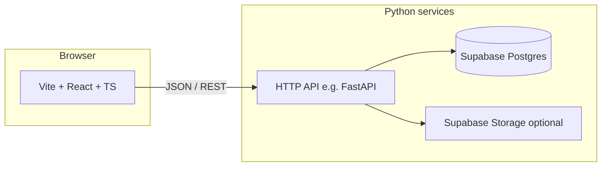

# BFam Rental — Implementation Plan

This document aligns user stories in `BFam Rental Stories.txt` with architecture, wireframes, and delivery phases.

## Locked stack decisions

| Concern | Choice |
|--------|--------|
| Database | **Supabase** (managed Postgres; optional Storage for item images) |
| Frontend | **Vite + React** with **TypeScript** |
| Backend | **Python** (**FastAPI**); **all reads and writes to the database go through Python** — the React app never holds Supabase DB credentials or calls PostgREST for data |
| Authentication | **Auth0** for **customers** and **admin** — **Free** tier for now; **Google** social + **email/password** (database connection); FastAPI validates JWTs on protected routes; admin uses the same API access token with role/email/sub allowlists |

## Python stack (recommended)

Use this as the default backend toolchain unless you explicitly need an ORM-first migration workflow (see alternative below).

| Piece | Choice | Why |
|--------|--------|-----|
| HTTP API | **[FastAPI](https://fastapi.tiangolo.com/)** | First-class OpenAPI docs, Pydantic v2 models, async-friendly, natural fit for a JSON API consumed by Vite + React. |
| Project & env | **[uv](https://docs.astral.sh/uv/)** | Fast installs, one tool for `venv`, dependency lock (`uv lock`), and running the app (`uv run`). Replaces juggling pip/poetry for most teams. |
| Supabase access | **[supabase-py](https://github.com/supabase/supabase-py)** (service role key **server-side only**) | Official client for Postgres and Storage; matches “everything goes through Python” without wiring SQLAlchemy to Supabase separately. Use `.table().select()` / `.insert()` etc., or RPC if you add SQL functions in Supabase later. |
| Config & validation | **Pydantic settings** (`pydantic-settings`) | Typed env (Supabase URL, keys, CORS origins); ships in the FastAPI ecosystem. |
| HTTP client (outbound) | **httpx** | Handy for Auth0 token introspection or webhooks later; commonly paired with FastAPI. |
| Tests | **pytest** + **httpx** `ASGITransport` | Call the FastAPI app in-process without a live server. |

**Runtime:** Python **3.12** (or current **3.13** if all deps support it — lock the minor version in `pyproject.toml` for the team).

### Alternative: SQLAlchemy + Alembic

Choose this if you want **schema migrations as Python/SQL files in the repo** and a classic ORM layer instead of the Supabase client API.

- **SQLAlchemy 2.0** (async with **asyncpg**) + **Alembic** for migrations, using Supabase’s **Postgres connection string** (not the anon key in the browser — still server-only).
- Slightly more setup; stronger when queries grow complex or you may move off Supabase hosting later while keeping the same SQL model.

For BFam Rental’s scope, **FastAPI + uv + supabase-py** is the better default: less glue, faster to ship, Storage stays straightforward.

## Architecture

- The React client calls only the Python API for catalog, filters, item detail, calendar data, booking requests, and admin operations.
- Python uses a Supabase **service role** or connection string to access Postgres (and Storage if used). Enforce booking rules and date validation on the server.

## User stories → capabilities

**Customer**

- List items available to rent; filter by item attributes.
- Item detail shows: Cost Per Day, Minimum Day Rental, Category, images (array), Description, Title, Deposit Amount, User Requirements.
- Per-item calendar: one status per date — *Out for Use*, *Booked*, *Open for Booking*, *Readying for Use*.
- Request a booking only for dates that are *Open for Booking*, within the next **60 days** from the request date.
- Show rental pricing as **cost per day × number of days** (rental subtotal), plus deposit, plus **sales tax** on the taxable portion as a separate line.
- **Sales tax on quotes (requirement):** Compute tax on each `POST /booking-requests/quote` (and keep booking/confirmation consistent with the same rules). **Prefer** an **official government-published API or rate service** for the business’s filing jurisdiction (e.g. state DOR / local tax authority where available). There is **no single U.S. federal** sales-tax API for local retail; the chosen source must be documented in code or README (URL, jurisdiction, and what is taxed). **No caching** of tax rates in the first version—each quote triggers a **fresh fetch** (accept latency tradeoff). If a jurisdiction lacks a usable API, document the fallback (e.g. official published rate tables updated manually, or a designated government data feed).
- **Email** (required) and **phone** (required) on booking requests; **quote** is emailed to that address when **SMTP** is configured on the API.
- When customer Auth0 is enabled: **My rentals** — list the signed-in customer’s booking requests (Bearer JWT); **Contact prefill** — `GET` endpoint returns the latest saved contact fields from prior bookings for that identity (driver’s license and license plate are never prefilled or reused from the API).
- When customer Auth0 is **not** configured, the SPA does not expose my-rentals or prefill (anonymous dev mode).

**Admin**

- Add rental items and their attributes.
- Mark items **active** or **inactive**: inactive items are omitted from the public catalog, item detail, and customer quote/booking APIs; admins still see them in the admin item list (visually highlighted) and can load them via `GET /admin/items/{id}` and `GET /admin/items/{id}/availability` for edit and calendar (public `GET /items/...` returns 404 for inactive items).
- Accept or **decline** proposed bookings (decline captures a reason, emails the customer with item and dates, sets requested days back to *Open for Booking*).
- Update each item’s per-date status.

**Default availability window**

- Creating an item via `POST /admin/items` **seeds** `item_day_status` for every day from **today through today + 60** (inclusive), each as `open_for_booking`, matching the customer booking window.
- On **GET** `/items/{id}/availability`, **GET** `/admin/items/{id}/availability`, **GET** `/items` with `open_from` / `open_to`, and before **quote** / **booking** validation, the API **upserts any missing** days in that same window as `open_for_booking` so the rolling horizon stays filled as calendar time moves (existing statuses such as `booked` are not overwritten).
- **Legacy databases:** uncomment and run **PART 4** in `Specs/supabase-setup.sql` once to backfill missing rows for items that predate seeding.

**Data model (items)**

- `items.active` (boolean, default `true`): when `false`, the item is hidden from customers; fresh installs use **`Specs/supabase-setup.sql`** (PART 1).

## UI wireframes (summary)

- **Catalog**: responsive grid; attribute-driven filters; optional search later.
- **Item detail**: gallery, full attribute block, calendar with legend, date selection for booking, quote with rental total, **tax line**, and deposit, submit booking request; signed-in customers get contact prefill from the server (except license uploads).
- **My rentals** (`/my-rentals`): signed-in customer list of their requests with link to item when applicable (only when Auth0 is enabled in the app).
- **Admin**: item list and create/edit forms; booking request queue with approve (then customer e-sign), resend signing link, payment-prep marks / confirm and decline (reason + customer email); per-item (or item-scoped) calendar editor for status by date.
- **Auth stub**: Sign-in / account placeholders without real Auth0 until enabled.

Mobile: single-column layouts, collapsible filters, calendar suited to small screens (e.g. scrollable month or week views).

## Suggested API surface (Python)

Define concrete routes during implementation; initial shape:

- `GET /items` — list with query params: `category` (exact), `min_cost_per_day`, `max_cost_per_day`, optional `open_from` + `open_to` (item must be `open_for_booking` on every day in range, inclusive).
- `GET /items/categories` — distinct category values for filter UI.
- `GET /items/{id}` — detail including image URLs and pricing fields.
- `GET /items/{id}/availability?from=&to=` — calendar slice (status per day).
- `POST /booking-requests` — `multipart/form-data`: `item_id`, `start_date`, `end_date`, required `customer_email`, `customer_phone`, `customer_first_name`, `customer_last_name`, `customer_address`, optional `notes`, required file `drivers_license`; if the item is **towable**, required file `license_plate`. Files go to Supabase Storage **`booking-documents`** by default (`BOOKING_DOCUMENTS_STORAGE=supabase`); use `BOOKING_DOCUMENTS_STORAGE=local` and `BOOKING_DOCUMENTS_LOCAL_DIR` for disk-only dev. Sends booking confirmation email when SMTP is configured.
- `GET /admin/booking-requests/{id}/files/drivers-license` | `license-plate` — admin-only; serves local file or redirects to a signed Storage URL.
- `POST /booking-requests/quote` — JSON: `item_id`, `start_date`, `end_date`, required `customer_email`; returns quote plus `email_sent` when SMTP delivers the quote email.
- `GET /booking-requests/mine` — **Requires** customer Auth0 (Bearer). Returns booking summaries for the JWT `sub` (no document URLs). **501** when Auth0 is not configured on the API.
- `GET /booking-requests/me/contact` — **Requires** customer Auth0 (Bearer). Returns latest contact fields from the customer’s prior bookings for form prefill, or **404** if none. **501** when Auth0 is not configured.
- Items include **`towable`** (boolean); admin sets it via item create/update.
- Admin (stub-guarded): `POST/PATCH /admin/items`, `POST /admin/booking-requests/{id}/approve` (JSON `payment_path`), `POST .../mark-rental-paid`, `POST .../mark-deposit-secured`, `POST .../mark-agreement-signed`, `POST .../confirm`, `POST /admin/booking-requests/{id}/decline` (JSON `reason`), `PUT /admin/items/{id}/availability` (or per-day PATCH).

## Data model (high level)

Tables or equivalent concepts (names illustrative):

- **items** — scalar attributes (title, description, category, cost_per_day, minimum_day_rental, deposit_amount, user_requirements, …).
- **item_images** — ordered images per item (or JSON array if kept simple early).
- **item_day_status** — `item_id`, `date`, `status` enum (four values).
- **booking_requests** — item, date range, lifecycle **status** (see Phase 1 / `Specs/payments-handoff/`), optional **decline_reason**, pricing snapshot, contact fields, optional **customer_auth0_sub**, document paths, workflow fields (fulfillment, payment prefs, timestamps for approval/payment/deposit/agreement).

## Delivery phases

1. **Monorepo layout** — `frontend/` (Vite+React+TS), `backend/` (Python), shared env documentation; Supabase project and schema migration path.
2. **Auth** — Admin: Auth0 Bearer + `AUTH0_ADMIN_*` on the API; SPA **Continue to admin** after sign-in. Customers: optional Auth0 SPA + JWT on quote/booking when `AUTH0_*` / `VITE_AUTH0_*` are set; otherwise anonymous quote/booking still allowed for dev.
3. **Read APIs** — items list, filters, item by id, availability range.
4. **Customer UI** — catalog, detail, calendar display.
5. **Booking** — POST booking request with server-side validation and rental total calculation.
6. **Admin UI + APIs** — CRUD items, edit day status, approve and confirm bookings (see Phase 1 below).
7. **Polish** — responsive QA, errors, empty states; tighten Auth0 (production tenants).

## Related files

- User stories and tech spec bullets: `Specs/BFam Rental Stories.txt`

## Phase 1 — Booking approval & payment prep (Codex handoff)

Product copy, lifecycle rules, and acceptance criteria live under **`Specs/payments-handoff/`** (see that folder’s `README.md`). Database changes for extended `booking_request_status` values, `booking_requests` workflow columns, `booking_events`, and `items.delivery_available` are defined in **`Specs/supabase-setup.sql`** (PART 0–1). **PART 0** drops existing BFam tables; run only when a full reset is acceptable.

**API (implemented in Python):** new bookings use status **`requested`** (legacy **`pending`** is still accepted on reads and for abandon/complete). Admin **`POST /admin/booking-requests/{id}/approve`** chooses **`payment_path`** (`card` / `ach` / `business_check`) and moves the row to **`approved_awaiting_signature`**: the API creates HTML snapshots + a signing token, emails the customer a link to **`{FRONTEND_PUBLIC_URL}/booking-actions/{token}/sign`**, and returns **`signing_url`** for the admin UI. The customer **`POST /booking-actions/{token}/sign`** (no auth) records acknowledgments, sets **`agreement_signed_at`**, advances to **`approved_pending_payment`** or **`approved_pending_check_clearance`**, and generates an executed PDF. **`GET /booking-actions/{token}/complete`** is the post-sign confirmation page. Admin **`POST /admin/booking-requests/{id}/resend-signature`** re-emails the link. Calendar days are marked **`booked`** only on **`POST .../confirm`**, after rental payment, deposit, and agreement are satisfied (agreement is normally satisfied by signing, not **`mark-agreement-signed`**). Optional env **`PAYMENT_COLLECTION_URL_TEMPLATE`** may include `{booking_id}` to populate **`payment_collection_url`** on approve. Declines use status **`declined`** (legacy **`rejected`** rows unchanged).

## Contract signing (Codex bundle)

Spec copy and field mapping: **`Specs/contract-signing/`** (see **`README.md`**). SQL: **`Specs/supabase-setup.sql`** (includes contract-signing tables and enum values). SPA routes: **`/booking-actions/:token/sign`** and **`/booking-actions/:token/complete`**.
